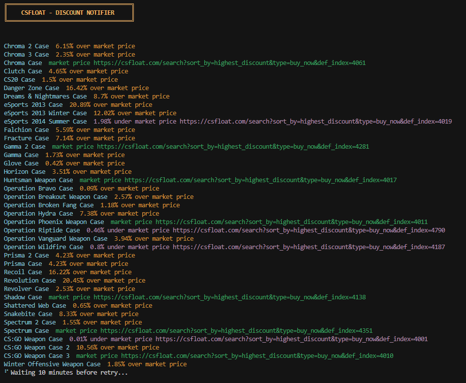

# 🎮 CSFloat Discount Notifier

> Get instant desktop notifications when great deals appear on CSFloat


## ✨ Features

- 🔔 Native notifications on Windows, macOS & Linux
- 📊 Tracks historical discount averages
- 🎯 Click notification to open item in browser
- ⚡ Lightweight background process



## 🚀 Quick Start

### Prerequisites

- [Node.js](https://nodejs.org/) v18+
- [pnpm](https://pnpm.io/installation): `npm install -g pnpm`
- [CSFloat API Key](https://csfloat.com/profile)

### Installation

```bash
git clone https://github.com/jrshutske/csfloat-discount-notifier.git
cd csfloat-discount-notifier
pnpm install

# Add your API key
cp .env.example .env
# Edit .env: CSFLOAT_API_KEY=your_key_here

# Run
pnpm start
```

## ⚙️ Configuration

**Edit `wishlist.json`** to track your items:

```json
[
  { "name": "Chroma 2 Case", "def_index": 4089 },
  { "name": "AK-47 Redline", "def_index": 7, "paint_index": 282 }
]
```

Find `def_index` and `paint_index` in CSFloat item URLs.

## 📦 Building Executables

```bash
pnpm build:exe         # Windows
pnpm build:exe:macos   # macOS (on Mac)
pnpm build:exe:linux   # Linux (on Linux)
```

The `build/` folder will contain:

- Executable
- `.env` template
- `wishlist.json`
- `README.txt`

> **Note:** Windows Defender may flag the `.exe` as a false positive (common with pkg). Either add an exclusion or run with Node.js installed.

## 🐛 Troubleshooting

**No notifications?**

- Windows: Enable in Settings > Notifications
- macOS: Check System Preferences > Notifications
- Linux: Install `libnotify-bin`

**API errors?**

- Check your `.env` has a valid API key
- Get a new key at [CSFloat](https://csfloat.com/profile)

## 🛠️ Tech Stack

TypeScript • Node.js • Axios • node-notifier • Chalk • pkg • esbuild

## 📄 License

MIT License - see [LICENSE](LICENSE) for details

---

⚠️ Not affiliated with CSFloat. Use responsibly and respect API rate limits.

**Happy deal hunting!** 🎯
